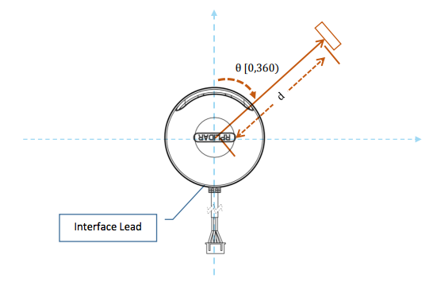

# RPLidar4J

RPLidar4J, is a Java library designed to manage the sensors [RPLidar A1 & RPLIDAR A2](http://www.slamtec.com/en/Lidar), a 2D LIDAR sensor in a easy way.

[](https://www.versioneye.com/user/projects/59046737e57fd5003857a94f)

# Demo GUI.java

https://youtu.be/nKdeGhDYD48

[](https://www.youtube.com/watch?v=nKdeGhDYD48)


# The sensor

RPLIDAR is a low cost 360 degree 2D laser scanner (LIDAR) solution 
developed by RoboPeak. The system can perform 360 degree scan within 
6 meter range. The produced 2D point cloud data can be used in mapping, 
localization and object/environment modeling

RPLIDAR is basically a laser triangulation measurement system. 
It can work excellent in all kinds of indoor environment and outdoor 
environment without sunlight.

The RPLIDAR adopts coordinate system of the left hand. The dead ahead 
of the sensors is the x axis of the coordinate system; the origin is 
the rotating center of the range scanner core. The rotation angle 
increases as rotating clockwise. The detailed definition is shown in 
the following figure:



**Technical docs:**

- [datasheet-rplidar](./docs/sdk/datasheet-rplidar.pdf)
- [communication-protocol](./docs/sdk/rpk-02-communication-protocol.pdf)

## Getting Started

### Connect the sensor on your robot

If you adquire a kit, the sensor includes a small
USB Controller. Connect plug the sensor with the USB Controller. 
Later, connect the USB Controller to your favourite Brick (EV3, BrickPi+ & PiStorms)
You should notice that the brick turn on the USB Controller and 
the sensor start turning. In order to know if EV3Dev recognize 
the sensor execute the command `lsusb`:

```
robot@ev3dev:/dev$ lsusb
Bus 001 Device 004: ID 10c4:ea60 Cygnal Integrated Products, Inc. CP210x UART Bridge / myAVR mySmartUSB light
Bus 001 Device 003: ID 0424:ec00 Standard Microsystems Corp. SMSC9512/9514 Fast Ethernet Adapter
Bus 001 Device 002: ID 0424:9514 Standard Microsystems Corp. 
Bus 001 Device 001: ID 1d6b:0002 Linux Foundation 2.0 root hub
```

If you detected this element: `Cygnal Integrated Products, Inc. CP210x UART Bridge / myAVR mySmartUSB light`
is a good signal, the USB Controller was recognized in the system.

Once you know that Lynux detect the USB Controller, it is necessary to
know in what device are associated. To list the devices of your brick,
type `ls /dev`:

```
robot@ev3dev:/dev$ ls /dev/
autofs           fb1      loop-control  memory_bandwidth    pts    ram4    snd     tty14  tty24  tty34  tty44  tty54  tty7       vc-mem  vcsa1
block            fd       loop0         mmcblk0             ram0   ram5    stderr  tty15  tty25  tty35  tty45  tty55  tty8       vchiq   vcsa2
btrfs-control    full     loop1         mmcblk0p1           ram1   ram6    stdin   tty16  tty26  tty36  tty46  tty56  tty9       vcio    vcsa3
bus              fuse     loop2         mmcblk0p2           ram10  ram7    stdout  tty17  tty27  tty37  tty47  tty57  ttyAMA0    vcs     vcsa4
cachefiles       gpiomem  loop3         mqueue              ram11  ram8    tty     tty18  tty28  tty38  tty48  tty58  ttyS0      vcs1    vcsa5
char             hwrng    loop4         net                 ram12  ram9    tty0    tty19  tty29  tty39  tty49  tty59  ttyUSB0    vcs2    vcsa6
console          i2c-1    loop5         network_latency     ram13  random  tty1    tty2   tty3   tty4   tty5   tty6   ttyprintk  vcs3    vcsm
cpu_dma_latency  initctl  loop6         network_throughput  ram14  raw     tty10   tty20  tty30  tty40  tty50  tty60  uhid       vcs4    vhci
cuse             input    loop7         null                ram15  rfkill  tty11   tty21  tty31  tty41  tty51  tty61  uinput     vcs5    watchdog
disk             kmsg     mapper        ppp                 ram2   serial  tty12   tty22  tty32  tty42  tty52  tty62  urandom    vcs6    watchdog0
fb0              log      mem           ptmx                ram3   shm     tty13   tty23  tty33  tty43  tty53  tty63  vc-cma     vcsa    zero
```

If you didn´t connect another device on your robot, the device 
`ttyUSB0` should be your RPLidarA1 sensor. 


### Add the dependency on the project

To use this project, import the library as a Maven dependency.

```
<dependency>
    <groupId>com.github.ev3dev-lang-java</groupId>
    <artifactId>RPLidar4J</artifactId>
    <version>0.4.0</version>
</dependency>
```

Further information: https://jitpack.io/#ev3dev-lang-java/RPLidar4J/0.4.0

### Using the sensor

Create a new Java project on your favourite IDE and add the following 
class on the project:

``` java
package examples;

import java.util.concurrent.CountDownLatch;

import ev3dev.sensors.slamtec.RPLidarA1;
import ev3dev.sensors.slamtec.RPLidarProviderListener;
import ev3dev.sensors.slamtec.model.Scan;
import ev3dev.sensors.slamtec.service.RpLidarDeviceInfo;
import lombok.extern.slf4j.Slf4j;

public @Slf4j class Continous
{

	public static void main(String[] args) throws Exception
	{

		log.info("Testing RPLidar on a EV3Dev with Java");
		final String USBPort = "/dev/ttyUSB0";
		final RPLidarA1 lidar = new RPLidarA1(USBPort);
		lidar.init();

		final CountDownLatch latch = new CountDownLatch(30);

		lidar.continuousScanning();

		lidar.addListener(new RPLidarProviderListener()
		{

			@Override
			public void scanFinished(Scan scan)
			{
				final long counter = scan.getDistances().stream().count();
				log.info(" Measures: {}", counter);
				latch.countDown();

			}

			@Override
			public void deviceInfo(RpLidarDeviceInfo info)
			{
			}
		});

		latch.await();

		lidar.close();
		log.info("End demo");
		System.exit(0);
	}
}

```

Once, you have the example in your project, create a Jar with the project
and deploy on your Brick using some Plugin for Maven or Gradle.

To run the example this the command:

```
java -jar /home/robot/RPLidar4J-all-0.4.0.jar
```


Example using RPLIDAR A1:

```
java -jar /home/robot/RPLidar4J-all-0.4.0.jar
2017-12-29 11:48:04 [main] INFO  examples.Continous:16 - Testing RPLidar on a EV3Dev with Java
2017-12-29 11:48:04 [main] INFO  e.sensors.slamtec.RPLidarA1Driver:42 - Starting a RPLidarA1 instance
2017-12-29 11:48:04 [main] INFO  e.sensors.slamtec.RPLidarA1Driver:52 - Connecting with: /dev/ttyUSB0
2017-12-29 11:48:04 [main] INFO  e.s.s.service.RpLidarLowLevelDriver:71 - Opening port /dev/ttyUSB0
2017-12-29 11:48:04 [main] INFO  e.s.s.service.RpLidarLowLevelDriver:96 - Successfully opened serial port.
2017-12-29 11:48:04 [main] WARN  e.s.s.service.RpLidarLowLevelDriver:218 - Resetting RPLidar
2017-12-29 11:48:05 [main] WARN  e.sensors.slamtec.RPLidarA1Driver:119 - Initiated continous scanning
2017-12-29 11:48:06 [EventThread /dev/ttyUSB0] INFO  examples.Continous:32 -  Measures: 305
2017-12-29 11:48:06 [EventThread /dev/ttyUSB0] INFO  examples.Continous:32 -  Measures: 318
2017-12-29 11:48:07 [EventThread /dev/ttyUSB0] INFO  examples.Continous:32 -  Measures: 319
2017-12-29 11:48:07 [EventThread /dev/ttyUSB0] INFO  examples.Continous:32 -  Measures: 319
2017-12-29 11:48:07 [EventThread /dev/ttyUSB0] INFO  examples.Continous:32 -  Measures: 319
2017-12-29 11:48:07 [EventThread /dev/ttyUSB0] INFO  examples.Continous:32 -  Measures: 319
2017-12-29 11:48:07 [EventThread /dev/ttyUSB0] INFO  examples.Continous:32 -  Measures: 318
2017-12-29 11:48:07 [EventThread /dev/ttyUSB0] INFO  examples.Continous:32 -  Measures: 319
2017-12-29 11:48:07 [EventThread /dev/ttyUSB0] INFO  examples.Continous:32 -  Measures: 319
2017-12-29 11:48:08 [EventThread /dev/ttyUSB0] INFO  examples.Continous:32 -  Measures: 319
2017-12-29 11:48:08 [EventThread /dev/ttyUSB0] INFO  examples.Continous:32 -  Measures: 320
2017-12-29 11:48:08 [EventThread /dev/ttyUSB0] INFO  examples.Continous:32 -  Measures: 318
2017-12-29 11:48:08 [EventThread /dev/ttyUSB0] INFO  examples.Continous:32 -  Measures: 319
2017-12-29 11:48:08 [EventThread /dev/ttyUSB0] INFO  examples.Continous:32 -  Measures: 319
2017-12-29 11:48:08 [EventThread /dev/ttyUSB0] INFO  examples.Continous:32 -  Measures: 319
2017-12-29 11:48:09 [EventThread /dev/ttyUSB0] INFO  examples.Continous:32 -  Measures: 318
2017-12-29 11:48:09 [EventThread /dev/ttyUSB0] INFO  examples.Continous:32 -  Measures: 319
2017-12-29 11:48:09 [EventThread /dev/ttyUSB0] INFO  examples.Continous:32 -  Measures: 319
2017-12-29 11:48:09 [EventThread /dev/ttyUSB0] INFO  examples.Continous:32 -  Measures: 318
2017-12-29 11:48:09 [EventThread /dev/ttyUSB0] INFO  examples.Continous:32 -  Measures: 319
2017-12-29 11:48:09 [EventThread /dev/ttyUSB0] INFO  examples.Continous:32 -  Measures: 319
2017-12-29 11:48:09 [EventThread /dev/ttyUSB0] INFO  examples.Continous:32 -  Measures: 319
2017-12-29 11:48:10 [EventThread /dev/ttyUSB0] INFO  examples.Continous:32 -  Measures: 317
2017-12-29 11:48:10 [EventThread /dev/ttyUSB0] INFO  examples.Continous:32 -  Measures: 318
2017-12-29 11:48:10 [EventThread /dev/ttyUSB0] INFO  examples.Continous:32 -  Measures: 318
2017-12-29 11:48:10 [EventThread /dev/ttyUSB0] INFO  examples.Continous:32 -  Measures: 318
2017-12-29 11:48:10 [EventThread /dev/ttyUSB0] INFO  examples.Continous:32 -  Measures: 318
2017-12-29 11:48:10 [EventThread /dev/ttyUSB0] INFO  examples.Continous:32 -  Measures: 318

```

## Acknowledgements

Many Thanks Peter Abeles by the initial development:
https://github.com/lessthanoptimal/jrplidar 


