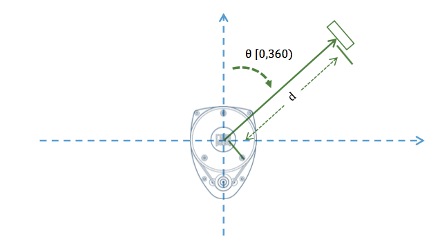

# RPLidar4J

RPLidar4J, is a Java library designed to manage the sensor [RPLidar A1](http://www.slamtec.com/en/Lidar), a 2D LIDAR sensor in a easy way.

[](https://www.versioneye.com/user/projects/59046737e57fd5003857a94f)


# The sensor

RPLIDAR is a low cost 360 degree 2D laser scanner (LIDAR) solution 
developed by RoboPeak. The system can perform 360 degree scan within 
6 meter range. The produced 2D point cloud data can be used in mapping, 
localization and object/environment modeling

RPLIDAR is basically a laser triangulation measurement system. 
It can work excellent in all kinds of indoor environment and outdoor 
environment without sunlight.

The RPLIDAR adopts coordinate system of the left hand. The dead ahead 
of the sensors is the x axis of the coordinate system; the origin is 
the rotating center of the range scanner core. The rotation angle 
increases as rotating clockwise. The detailed definition is shown in 
the following figure:



**Technical docs:**

- [datasheet-rplidar](./docs/sdk/datasheet-rplidar.pdf)
- [communication-protocol](./docs/rpk-02-communication-protocol.pdf)

## Getting Started

### Connect the sensor on your robot

If you adquire the RPLidarA1 Kit, the sensor includes in the Kit a small
USB Controller. Connect plug the sensor with the USB Controller. 
Later, connect the USB Controller to your favourite Brick (EV3, BrickPi+ & PiStorms)
You should notice that the brick turn on the USB Controller and 
the sensor start turning. In order to know if EV3Dev recognize 
the sensor execute the command `lsusb`:

```
robot@ev3dev:/dev$ lsusb
Bus 001 Device 004: ID 10c4:ea60 Cygnal Integrated Products, Inc. CP210x UART Bridge / myAVR mySmartUSB light
Bus 001 Device 003: ID 0424:ec00 Standard Microsystems Corp. SMSC9512/9514 Fast Ethernet Adapter
Bus 001 Device 002: ID 0424:9514 Standard Microsystems Corp. 
Bus 001 Device 001: ID 1d6b:0002 Linux Foundation 2.0 root hub
```

If you detected this element: `Cygnal Integrated Products, Inc. CP210x UART Bridge / myAVR mySmartUSB light`
is a good signal, the USB Controller was recognized in the system.

Once you know that Lynux detect the USB Controller, it is necessary to
know in what device are associated. To list the devices of your brick,
type `ls /dev`:

```
robot@ev3dev:/dev$ ls /dev/
autofs           fb1      loop-control  memory_bandwidth    pts    ram4    snd     tty14  tty24  tty34  tty44  tty54  tty7       vc-mem  vcsa1
block            fd       loop0         mmcblk0             ram0   ram5    stderr  tty15  tty25  tty35  tty45  tty55  tty8       vchiq   vcsa2
btrfs-control    full     loop1         mmcblk0p1           ram1   ram6    stdin   tty16  tty26  tty36  tty46  tty56  tty9       vcio    vcsa3
bus              fuse     loop2         mmcblk0p2           ram10  ram7    stdout  tty17  tty27  tty37  tty47  tty57  ttyAMA0    vcs     vcsa4
cachefiles       gpiomem  loop3         mqueue              ram11  ram8    tty     tty18  tty28  tty38  tty48  tty58  ttyS0      vcs1    vcsa5
char             hwrng    loop4         net                 ram12  ram9    tty0    tty19  tty29  tty39  tty49  tty59  ttyUSB0    vcs2    vcsa6
console          i2c-1    loop5         network_latency     ram13  random  tty1    tty2   tty3   tty4   tty5   tty6   ttyprintk  vcs3    vcsm
cpu_dma_latency  initctl  loop6         network_throughput  ram14  raw     tty10   tty20  tty30  tty40  tty50  tty60  uhid       vcs4    vhci
cuse             input    loop7         null                ram15  rfkill  tty11   tty21  tty31  tty41  tty51  tty61  uinput     vcs5    watchdog
disk             kmsg     mapper        ppp                 ram2   serial  tty12   tty22  tty32  tty42  tty52  tty62  urandom    vcs6    watchdog0
fb0              log      mem           ptmx                ram3   shm     tty13   tty23  tty33  tty43  tty53  tty63  vc-cma     vcsa    zero
```

If you didn´t connect another device on your robot, the device 
`ttyUSB0` should be your RPLidarA1 sensor. 

### Install librxtx-java

Current implementation uses the library `librxtx-java` to manage 
the Serial port communications. This library is very popular on Java 
ecosystem. To install the library on your brick, install the following 
Debian package:

```
sudo apt-get install librxtx-java
```

When the Debian package is finished, you should be the native library on
the following path: `/usr/lib/jni/`

```
robot@ev3dev:~$ ls /usr/lib/jni/
libopencv_java249.so   librxtxI2C.so               librxtxParallel.so       librxtxRS485.so        librxtxRaw.so             librxtxSerial.so
librxtxI2C-2.2pre1.so  librxtxParallel-2.2pre1.so  librxtxRS485-2.2pre1.so  librxtxRaw-2.2pre1.so  librxtxSerial-2.2pre1.so
```

### Add the dependency on the project

To use this project, import the library as a Maven dependency.

```
<dependency>
    <groupId>com.github.ev3dev-lang-java</groupId>
    <artifactId>RPLidar4J</artifactId>
    <version>v0.2.0</version>
</dependency>
```

Further information: https://jitpack.io/#ev3dev-lang-java/RPLidar4J/v0.2.0

### Using the sensor

Create a new Java project on your favourite IDE and add the following 
class on the project:

``` java
package examples;

import ev3dev.sensors.slamtec.RPLidarA1;
import ev3dev.sensors.slamtec.model.Scan;
import lombok.extern.slf4j.Slf4j;

public @Slf4j class Demo {

    public static void main(String[] args) throws Exception {

        log.info("Testing RPLidar on a EV3 Brick with Java");
        final String USBPort = "/dev/ttyUSB0";
        final RPLidarA1 lidar = new RPLidarA1(USBPort);
        lidar.init();

        for(int x = 0; x <= 5; x++){

            final Scan scan = lidar.scan();
            log.info("Iteration: {}, Measures: {}", x, scan.getDistances().size());
            scan.getDistances()
                .stream()
                .filter((measure) -> measure.getQuality() > 10)
                .filter((measure) -> (measure.getAngle() >= 345 || measure.getAngle() <= 15))
                .filter((measure) -> measure.getDistance() <= 50)
                .forEach(System.out::println);
        }

        lidar.close();
        log.info("End demo");
        System.exit(0);
    }
}
```

Once, you have the example in your project, create a Jar with the project
and deploy on your Brick using some Plugin for Maven or Gradle.

To run the example this the command:

```
java -Djava.library.path=/usr/lib/jni/ -jar /home/robot/RPLidar4J-all-0.4.0.jar
```

### Output

Example using RPLIDAR A2:

```
java -Djava.library.path=/usr/lib/jni/ -jar /home/robot/RPLidar4J-all-0.4.0.jar
ev3dev#3|17:05:12.652 [main] INFO examples.Demo4 - Testing RPLidar on a EV3Dev with Java
ev3dev#3|17:05:13.075 [main] INFO ev3dev.sensors.slamtec.RPLidarA1Driver - Starting a RPLidarA1 instance
ev3dev#3|17:05:13.086 [main] INFO ev3dev.sensors.slamtec.RPLidarA1Driver - Connecting with: /dev/ttyUSB0
ev3dev#3|17:05:13.392 [main] INFO ev3dev.sensors.slamtec.service.RpLidarLowLevelDriver - Opening port /dev/ttyUSB0
ev3dev#3|Stable Library
ev3dev#3|=========================================
ev3dev#3|Native lib Version = RXTX-2.2pre2
ev3dev#3|Java lib Version   = RXTX-2.1-7
ev3dev#3|WARNING:  RXTX Version mismatch
ev3dev#3|	Jar version = RXTX-2.1-7
ev3dev#3|	native lib Version = RXTX-2.2pre2
ev3dev#3|17:05:16.813 [Thread-1] INFO examples.Demo4 - Measures: 51
ev3dev#3|17:05:16.854 [Thread-1] INFO examples.Demo4 - Measures: 2
ev3dev#3|17:05:17.012 [Thread-1] INFO examples.Demo4 - Measures: 311
ev3dev#3|17:05:17.137 [Thread-1] INFO examples.Demo4 - Measures: 289
ev3dev#3|17:05:17.282 [Thread-1] INFO examples.Demo4 - Measures: 271
ev3dev#3|17:05:17.394 [Thread-1] INFO examples.Demo4 - Measures: 257
ev3dev#3|17:05:17.522 [Thread-1] INFO examples.Demo4 - Measures: 246
ev3dev#3|17:05:17.675 [Thread-1] INFO examples.Demo4 - Measures: 236
ev3dev#3|17:05:17.782 [Thread-1] INFO examples.Demo4 - Measures: 228
ev3dev#3|17:05:17.893 [Thread-1] INFO examples.Demo4 - Measures: 223
ev3dev#3|17:05:18.001 [Thread-1] INFO examples.Demo4 - Measures: 216
ev3dev#3|17:05:18.092 [Thread-1] INFO examples.Demo4 - Measures: 212
ev3dev#3|17:05:18.184 [Thread-1] INFO examples.Demo4 - Measures: 208
ev3dev#3|17:05:18.256 [Thread-1] INFO examples.Demo4 - Measures: 204
ev3dev#3|17:05:18.337 [Thread-1] INFO examples.Demo4 - Measures: 199
ev3dev#3|17:05:18.404 [Thread-1] INFO examples.Demo4 - Measures: 197
ev3dev#3|17:05:18.479 [Thread-1] INFO examples.Demo4 - Measures: 194
ev3dev#3|17:05:18.570 [Thread-1] INFO examples.Demo4 - Measures: 191
ev3dev#3|17:05:18.657 [Thread-1] INFO examples.Demo4 - Measures: 191
ev3dev#3|17:05:18.751 [Thread-1] INFO examples.Demo4 - Measures: 188
ev3dev#3|17:05:18.781 [Thread-1] INFO examples.Demo4 - Measures: 80
ev3dev#3|17:05:18.814 [Thread-1] INFO examples.Demo4 - Measures: 107
ev3dev#3|17:05:18.842 [Thread-1] INFO examples.Demo4 - Measures: 186
ev3dev#3|17:05:18.929 [Thread-1] INFO examples.Demo4 - Measures: 183
ev3dev#3|17:05:19.006 [Thread-1] INFO examples.Demo4 - Measures: 180
ev3dev#3|17:05:19.057 [Thread-1] INFO examples.Demo4 - Measures: 53
ev3dev#3|17:05:19.107 [Thread-1] INFO examples.Demo4 - Measures: 125
ev3dev#3|17:05:19.203 [Thread-1] INFO examples.Demo4 - Measures: 178
ev3dev#3|17:05:19.282 [Thread-1] INFO examples.Demo4 - Measures: 138
ev3dev#3|17:05:19.301 [Thread-1] INFO examples.Demo4 - Measures: 1
ev3dev#3|17:05:19.317 [Thread-1] INFO examples.Demo4 - Measures: 1
ev3dev#3|17:05:19.337 [Thread-1] INFO examples.Demo4 - Measures: 36
ev3dev#3|17:05:19.381 [Thread-1] INFO examples.Demo4 - Measures: 177
ev3dev#3|17:05:19.463 [Thread-1] INFO examples.Demo4 - Measures: 176
ev3dev#3|17:05:19.508 [Thread-1] INFO examples.Demo4 - Measures: 64
ev3dev#3|17:05:19.538 [Thread-1] INFO examples.Demo4 - Measures: 50
ev3dev#3|17:05:19.551 [Thread-1] INFO examples.Demo4 - Measures: 1
ev3dev#3|17:05:19.578 [Thread-1] INFO examples.Demo4 - Measures: 58
ev3dev#3|17:05:19.639 [Thread-1] INFO examples.Demo4 - Measures: 175
ev3dev#3|17:05:19.662 [Thread-1] INFO examples.Demo4 - Measures: 18
ev3dev#3|17:05:19.739 [Thread-1] INFO examples.Demo4 - Measures: 156
ev3dev#3|17:05:19.815 [Thread-1] INFO examples.Demo4 - Measures: 174
ev3dev#3|17:05:20.001 [Thread-1] INFO examples.Demo4 - Measures: 326
ev3dev#3|17:05:20.022 [Thread-1] INFO examples.Demo4 - Measures: 20
ev3dev#3|17:05:20.078 [Thread-1] INFO examples.Demo4 - Measures: 174
ev3dev#3|17:05:20.173 [Thread-1] INFO examples.Demo4 - Measures: 172
ev3dev#3|17:05:20.250 [Thread-1] INFO examples.Demo4 - Measures: 172
ev3dev#3|17:05:20.353 [Thread-1] INFO examples.Demo4 - Measures: 172
ev3dev#3|17:05:20.431 [Thread-1] INFO examples.Demo4 - Measures: 171
ev3dev#3|17:05:20.587 [Thread-1] INFO examples.Demo4 - Measures: 174
ev3dev#3|17:05:20.640 [Thread-1] INFO examples.Demo4 - Measures: 173
ev3dev#3|17:05:20.690 [Thread-1] INFO examples.Demo4 - Measures: 172
ev3dev#3|17:05:20.763 [Thread-1] INFO examples.Demo4 - Measures: 117
ev3dev#3|17:05:20.791 [Thread-1] INFO examples.Demo4 - Measures: 54
ev3dev#3|17:05:20.863 [Thread-1] INFO examples.Demo4 - Measures: 172
ev3dev#3|17:05:20.944 [Thread-1] INFO examples.Demo4 - Measures: 170
ev3dev#3|17:05:21.043 [Thread-1] INFO examples.Demo4 - Measures: 170
ev3dev#3|17:05:21.119 [Thread-1] INFO examples.Demo4 - Measures: 172
ev3dev#3|17:05:21.222 [Thread-1] INFO examples.Demo4 - Measures: 169
ev3dev#3|17:05:21.299 [Thread-1] INFO examples.Demo4 - Measures: 172
ev3dev#3|17:05:21.382 [Thread-1] INFO examples.Demo4 - Measures: 171
ev3dev#3|17:05:21.427 [Thread-1] INFO examples.Demo4 - Measures: 61
ev3dev#3|17:05:21.477 [Thread-1] INFO examples.Demo4 - Measures: 109
ev3dev#3|17:05:21.531 [Thread-1] INFO examples.Demo4 - Measures: 92
ev3dev#3|17:05:21.561 [Thread-1] INFO examples.Demo4 - Measures: 80
ev3dev#3|17:05:21.651 [Thread-1] INFO examples.Demo4 - Measures: 172
ev3dev#3|17:05:21.702 [Thread-1] INFO examples.Demo4 - Measures: 87
ev3dev#3|17:05:21.729 [Thread-1] INFO examples.Demo4 - Measures: 83
ev3dev#3|17:05:21.827 [Thread-1] INFO examples.Demo4 - Measures: 169
ev3dev#3|17:05:21.842 [Thread-1] INFO examples.Demo4 - Measures: 1
ev3dev#3|17:05:21.863 [Thread-1] INFO examples.Demo4 - Measures: 1
ev3dev#3|17:05:21.903 [Thread-1] INFO examples.Demo4 - Measures: 172
ev3dev#3|17:05:21.983 [Thread-1] INFO examples.Demo4 - Measures: 171
```

Example using RPLIDAR A1:

```
java -Djava.library.path=/usr/lib/jni/ -jar /home/robot/RPLidar4J-all-0.4.0.jar
ev3dev#5|17:09:45.943 [main] INFO examples.Demo4 - Testing RPLidar on a EV3Dev with Java
ev3dev#5|17:09:46.377 [main] INFO ev3dev.sensors.slamtec.RPLidarA1Driver - Starting a RPLidarA1 instance
ev3dev#5|17:09:46.388 [main] INFO ev3dev.sensors.slamtec.RPLidarA1Driver - Connecting with: /dev/ttyUSB1
ev3dev#5|17:09:46.678 [main] INFO ev3dev.sensors.slamtec.service.RpLidarLowLevelDriver - Opening port /dev/ttyUSB1
ev3dev#5|Stable Library
ev3dev#5|=========================================
ev3dev#5|Native lib Version = RXTX-2.2pre2
ev3dev#5|Java lib Version   = RXTX-2.1-7
ev3dev#5|WARNING:  RXTX Version mismatch
ev3dev#5|	Jar version = RXTX-2.1-7
ev3dev#5|	native lib Version = RXTX-2.2pre2
ev3dev#5|17:09:50.197 [Thread-1] INFO examples.Demo4 - Measures: 54
ev3dev#5|17:09:50.306 [Thread-1] INFO examples.Demo4 - Measures: 151
ev3dev#5|17:09:50.457 [Thread-1] INFO examples.Demo4 - Measures: 325
ev3dev#5|17:09:50.609 [Thread-1] INFO examples.Demo4 - Measures: 326
ev3dev#5|17:09:50.734 [Thread-1] INFO examples.Demo4 - Measures: 326
ev3dev#5|17:09:50.928 [Thread-1] INFO examples.Demo4 - Measures: 326
ev3dev#5|17:09:50.990 [Thread-1] INFO examples.Demo4 - Measures: 76
ev3dev#5|17:09:51.021 [Thread-1] INFO examples.Demo4 - Measures: 1
ev3dev#5|17:09:51.139 [Thread-1] INFO examples.Demo4 - Measures: 249
ev3dev#5|17:09:51.290 [Thread-1] INFO examples.Demo4 - Measures: 326
ev3dev#5|17:09:51.422 [Thread-1] INFO examples.Demo4 - Measures: 327
ev3dev#5|17:09:51.559 [Thread-1] INFO examples.Demo4 - Measures: 330
ev3dev#5|17:09:51.687 [Thread-1] INFO examples.Demo4 - Measures: 330
ev3dev#5|17:09:51.719 [Thread-1] INFO examples.Demo4 - Measures: 72
ev3dev#5|17:09:51.778 [Thread-1] INFO examples.Demo4 - Measures: 256
ev3dev#5|17:09:51.862 [Thread-1] INFO examples.Demo4 - Measures: 326
ev3dev#5|17:09:52.013 [Thread-1] INFO examples.Demo4 - Measures: 324
ev3dev#5|17:09:52.044 [Thread-1] INFO examples.Demo4 - Measures: 8
ev3dev#5|17:09:52.163 [Thread-1] INFO examples.Demo4 - Measures: 253
ev3dev#5|17:09:52.197 [Thread-1] INFO examples.Demo4 - Measures: 63
ev3dev#5|17:09:52.218 [Thread-1] INFO examples.Demo4 - Measures: 37
ev3dev#5|17:09:52.296 [Thread-1] INFO examples.Demo4 - Measures: 152
ev3dev#5|17:09:52.348 [Thread-1] INFO examples.Demo4 - Measures: 136
ev3dev#5|17:09:52.422 [Thread-1] INFO examples.Demo4 - Measures: 116
ev3dev#5|17:09:52.529 [Thread-1] INFO examples.Demo4 - Measures: 209
ev3dev#5|17:09:52.689 [Thread-1] INFO examples.Demo4 - Measures: 325
ev3dev#5|17:09:52.863 [Thread-1] INFO examples.Demo4 - Measures: 323
ev3dev#5|17:09:53.020 [Thread-1] INFO examples.Demo4 - Measures: 323
ev3dev#5|17:09:53.079 [Thread-1] INFO examples.Demo4 - Measures: 80
ev3dev#5|17:09:53.179 [Thread-1] INFO examples.Demo4 - Measures: 243
ev3dev#5|17:09:53.353 [Thread-1] INFO examples.Demo4 - Measures: 322
ev3dev#5|17:09:53.514 [Thread-1] INFO examples.Demo4 - Measures: 325
ev3dev#5|17:09:53.614 [Thread-1] INFO examples.Demo4 - Measures: 168
ev3dev#5|17:09:53.647 [Thread-1] INFO examples.Demo4 - Measures: 1
ev3dev#5|17:09:53.697 [Thread-1] INFO examples.Demo4 - Measures: 157
ev3dev#5|17:09:53.844 [Thread-1] INFO examples.Demo4 - Measures: 324
ev3dev#5|17:09:53.972 [Thread-1] INFO examples.Demo4 - Measures: 225
ev3dev#5|17:09:54.207 [Thread-1] INFO examples.Demo4 - Measures: 426
ev3dev#5|17:09:54.258 [Thread-1] INFO examples.Demo4 - Measures: 133
ev3dev#5|17:09:54.285 [Thread-1] INFO examples.Demo4 - Measures: 50
ev3dev#5|17:09:54.306 [Thread-1] INFO examples.Demo4 - Measures: 1
ev3dev#5|17:09:54.335 [Thread-1] INFO examples.Demo4 - Measures: 142
ev3dev#5|17:09:54.518 [Thread-1] INFO examples.Demo4 - Measures: 323
ev3dev#5|17:09:54.618 [Thread-1] INFO examples.Demo4 - Measures: 190
ev3dev#5|17:09:54.672 [Thread-1] INFO examples.Demo4 - Measures: 135
ev3dev#5|17:09:54.749 [Thread-1] INFO examples.Demo4 - Measures: 117
ev3dev#5|17:09:54.854 [Thread-1] INFO examples.Demo4 - Measures: 208
ev3dev#5|17:09:55.011 [Thread-1] INFO examples.Demo4 - Measures: 296
ev3dev#5|17:09:55.038 [Thread-1] INFO examples.Demo4 - Measures: 1
ev3dev#5|17:09:55.067 [Thread-1] INFO examples.Demo4 - Measures: 28
ev3dev#5|17:09:55.137 [Thread-1] INFO examples.Demo4 - Measures: 225
ev3dev#5|17:09:55.188 [Thread-1] INFO examples.Demo4 - Measures: 100
ev3dev#5|17:09:55.347 [Thread-1] INFO examples.Demo4 - Measures: 324
ev3dev#5|17:09:55.400 [Thread-1] INFO examples.Demo4 - Measures: 80
ev3dev#5|17:09:55.503 [Thread-1] INFO examples.Demo4 - Measures: 245
ev3dev#5|17:09:55.681 [Thread-1] INFO examples.Demo4 - Measures: 325
ev3dev#5|17:09:55.718 [Thread-1] INFO examples.Demo4 - Measures: 34
ev3dev#5|17:09:55.784 [Thread-1] INFO examples.Demo4 - Measures: 153
ev3dev#5|17:09:55.838 [Thread-1] INFO examples.Demo4 - Measures: 139
ev3dev#5|17:09:55.911 [Thread-1] INFO examples.Demo4 - Measures: 112
ev3dev#5|17:09:55.929 [Thread-1] INFO examples.Demo4 - Measures: 1
ev3dev#5|17:09:56.017 [Thread-1] INFO examples.Demo4 - Measures: 212
ev3dev#5|17:09:56.179 [Thread-1] INFO examples.Demo4 - Measures: 325
ev3dev#5|17:09:56.353 [Thread-1] INFO examples.Demo4 - Measures: 323
ev3dev#5|17:09:56.510 [Thread-1] INFO examples.Demo4 - Measures: 324
ev3dev#5|17:09:56.667 [Thread-1] INFO examples.Demo4 - Measures: 326
ev3dev#5|17:09:56.845 [Thread-1] INFO examples.Demo4 - Measures: 325
ev3dev#5|17:09:56.867 [Thread-1] INFO examples.Demo4 - Measures: 28
ev3dev#5|17:09:56.944 [Thread-1] INFO examples.Demo4 - Measures: 152
ev3dev#5|17:09:57.000 [Thread-1] INFO examples.Demo4 - Measures: 146
ev3dev#5|17:09:57.185 [Thread-1] INFO examples.Demo4 - Measures: 326
ev3dev#5|17:09:57.229 [Thread-1] INFO examples.Demo4 - Measures: 33
ev3dev#5|17:09:57.334 [Thread-1] INFO examples.Demo4 - Measures: 293
```


## UML Design


## TODO

- Improve the Design solution
- Refactor Service layer
- Add LeJOS Sensor support
- Add Mock test


