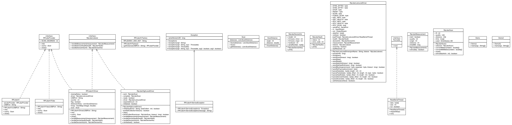

# RPLidar4J

RPLidar4J, is a Java library designed to manage the sensor  
 [RPLidar A1](http://www.slamtec.com/en/Lidar), a 2D LIDAR sensor in a easy way.


## TODO

- Detect USBDevice connected
- Release a Snapshot version on https://jitpack.io
- Add LeJOS Sensor support
- Add Mock support
- Return always a Scan object with 360 values

## Getting Started

### Connect the sensor on your robot

If you adquire the RPLidarA1 Kit, the sensor includes in the Kit a small
USB Controller. Connect plug the sensor with the USB Controller. 
Later, connect the USB Controller to your favourite Brick (EV3, BrickPi+ & PiStorms)
You should notice that the brick turn on the USB Controller and 
the sensor start turning. In order to know if EV3Dev recognize 
the sensor execute the command `lsusb`:

```
robot@ev3dev:/dev$ lsusb
Bus 001 Device 004: ID 10c4:ea60 Cygnal Integrated Products, Inc. CP210x UART Bridge / myAVR mySmartUSB light
Bus 001 Device 003: ID 0424:ec00 Standard Microsystems Corp. SMSC9512/9514 Fast Ethernet Adapter
Bus 001 Device 002: ID 0424:9514 Standard Microsystems Corp. 
Bus 001 Device 001: ID 1d6b:0002 Linux Foundation 2.0 root hub
```

If you detected this element: `Cygnal Integrated Products, Inc. CP210x UART Bridge / myAVR mySmartUSB light`
is a good signal, the USB Controller was recognized in the system.

Once you know that Lynux detect the USB Controller, it is necessary to
know in what device are associated. To list the devices of your brick,
type `ls /dev`:

```
robot@ev3dev:/dev$ ls /dev/
autofs           fb1      loop-control  memory_bandwidth    pts    ram4    snd     tty14  tty24  tty34  tty44  tty54  tty7       vc-mem  vcsa1
block            fd       loop0         mmcblk0             ram0   ram5    stderr  tty15  tty25  tty35  tty45  tty55  tty8       vchiq   vcsa2
btrfs-control    full     loop1         mmcblk0p1           ram1   ram6    stdin   tty16  tty26  tty36  tty46  tty56  tty9       vcio    vcsa3
bus              fuse     loop2         mmcblk0p2           ram10  ram7    stdout  tty17  tty27  tty37  tty47  tty57  ttyAMA0    vcs     vcsa4
cachefiles       gpiomem  loop3         mqueue              ram11  ram8    tty     tty18  tty28  tty38  tty48  tty58  ttyS0      vcs1    vcsa5
char             hwrng    loop4         net                 ram12  ram9    tty0    tty19  tty29  tty39  tty49  tty59  ttyUSB0    vcs2    vcsa6
console          i2c-1    loop5         network_latency     ram13  random  tty1    tty2   tty3   tty4   tty5   tty6   ttyprintk  vcs3    vcsm
cpu_dma_latency  initctl  loop6         network_throughput  ram14  raw     tty10   tty20  tty30  tty40  tty50  tty60  uhid       vcs4    vhci
cuse             input    loop7         null                ram15  rfkill  tty11   tty21  tty31  tty41  tty51  tty61  uinput     vcs5    watchdog
disk             kmsg     mapper        ppp                 ram2   serial  tty12   tty22  tty32  tty42  tty52  tty62  urandom    vcs6    watchdog0
fb0              log      mem           ptmx                ram3   shm     tty13   tty23  tty33  tty43  tty53  tty63  vc-cma     vcsa    zero
```

If you didn´t connect another device on your robot, the device 
`ttyUSB0` should be your RPLidarA1 sensor. 

### Install librxtx-java

Current implementation uses the library `librxtx-java` to manage 
the Serial port communications. This library is very popular on Java 
ecosystem. To install the library on your brick, install the following 
Debian package:

```
sudo apt-get install librxtx-java
```

When the Debian package is finished, you should be the native library on
the following path: `/usr/lib/jni/`

```
robot@ev3dev:~$ ls /usr/lib/jni/
libopencv_java249.so   librxtxI2C.so               librxtxParallel.so       librxtxRS485.so        librxtxRaw.so             librxtxSerial.so
librxtxI2C-2.2pre1.so  librxtxParallel-2.2pre1.so  librxtxRS485-2.2pre1.so  librxtxRaw-2.2pre1.so  librxtxSerial-2.2pre1.so
```

### Add the dependency on the project

To use this project, import the library as a Maven dependency.

PENDING TO HAVE A SNAPSHOT

### Using the sensor

Create a new Java project on your favourite IDE and add the following 
class on the project:

//TODO Improve the example adding a filter from the angle 345-15º using streams

``` java
package examples;

import ev3dev.sensors.slamtec.RPLidarA1;
import ev3dev.sensors.slamtec.model.Scan;
import lombok.extern.slf4j.Slf4j;

public @Slf4j class Demo {

    public static void main(String[] args) throws Exception {

        final String USBPort = "ttyUSB0";
        final RPLidarA1 lidar = new RPLidarA1(USBPort);
        lidar.init();

        for(int x = 0; x <= 5; x++){
            final long counter = lidar.scan().getDistances()
                    .stream()
                    .count();
            log.info("Measures: {}", counter);
        }

        lidar.close();
        log.info("End demo");
        System.exit(0);
    }
}

```

Once, you have the example in your project, create a Jar with the project
and deploy on your Brick using some Plugin for Maven or Gradle.

To run the example this the command:

```
java -Djava.library.path=/usr/lib/jni/ -cp RPLidar4J-all-0.1.0.jar examples.Demo
```

### Output

```
robot@ev3dev:~$ java -Djava.library.path=/usr/lib/jni/ -cp RPLidar4J-all-0.1.0.jar examples.Demo
2017-03-18 13:08:37 [main] TRACE e.sensors.slamtec.RPLidarA1Driver - Returning a RPLidarA1 Object
Opening port /dev/ttyUSB0
Stable Library
=========================================
Native lib Version = RXTX-2.2pre2
Java lib Version   = RXTX-2.1-7
WARNING:  RXTX Version mismatch
	Jar version = RXTX-2.1-7
	native lib Version = RXTX-2.2pre2
2017-03-18 13:08:39 [main] INFO  e.sensors.slamtec.RPLidarA1Driver - 1106
2017-03-18 13:08:39 [main] INFO  examples.Demo - Measures: 276
2017-03-18 13:08:42 [main] INFO  e.sensors.slamtec.RPLidarA1Driver - 1107
2017-03-18 13:08:42 [main] INFO  examples.Demo - Measures: 298
2017-03-18 13:08:46 [main] INFO  e.sensors.slamtec.RPLidarA1Driver - 1707
2017-03-18 13:08:46 [main] INFO  examples.Demo - Measures: 297
2017-03-18 13:08:48 [main] INFO  e.sensors.slamtec.RPLidarA1Driver - 1707
2017-03-18 13:08:48 [main] INFO  examples.Demo - Measures: 297
2017-03-18 13:08:48 [main] INFO  examples.Demo - End demo
```

## UML Design



https://lejos.sourceforge.io/forum/viewtopic.php?t=6986

http://www.robopeak.com/blog/?p=611

```
cd ~
mkdir slamtec          
mkdir slamtec/rplidara1
cd slamtec/rplidara1/
wget http://www.slamtec.com/download/lidar/sdk/rplidar_sdk.1.4.5.7z
wget http://www.slamtec.com/download/lidar/sdk/rplidar_sdk_v1.5.7.zip
sudo apt-get install p7zip-full
sudo apt-get install unzip
7z x ~/slamtec/rplidara1/rplidar_sdk_v1.4.5.7z
7z x ~/slamtec/rplidara1/rplidar_sdk_v1.5.7.zip
unzip rplidar_sdk_v1.5.7.zip -d rplidar_sdk_v1.5.7
sudo apt-get install build-essential
cd rplidar_sdk_v1.5.7/sdk
make
```

```
cd ./output/Linux/Release
./simple_grabber /dev/ttyUSB0
./ultra_simple /dev/ttyUSB0
```
